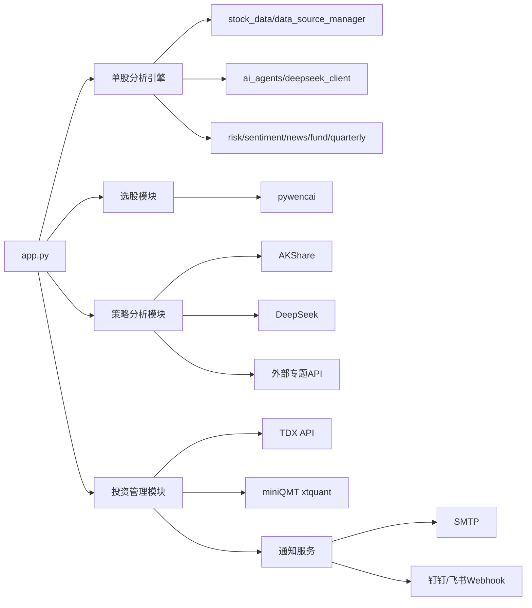

# 复合多AI智能体股票团队分析系统：项目模块与三方接口详解

## 1. 项目定位与总体架构

本项目是一个基于 `Streamlit` 的多模块股票分析平台，核心目标是把“数据抓取 → 量化指标 → 多智能体研判 → 策略输出/监控执行”串成完整链路。

- 主入口：`app.py`（统一导航与页面编排）
- 启动脚本：`run.py`
- AI能力内核：`deepseek_client.py` + `ai_agents.py`
- 数据能力内核：`stock_data.py` + `data_source_manager.py`
- 各业务模块：选股、策略分析、宏观分析、新闻流量、实时监控、AI盯盘、持仓管理
- 存储层：多个 `SQLite` 数据库（按业务拆分）

---

## 2. 技术栈与外部依赖总览

### 2.1 主要技术栈
- Web UI：`streamlit`
- 数据处理：`pandas`、`numpy`
- 图表：`plotly`
- 技术指标：`ta`（部分模块也手工计算）
- 报告导出：`reportlab`
- 调度：`schedule`
- 持久化：`sqlite3`（多库）

### 2.2 关键三方数据/服务接口
- LLM（OpenAI兼容）：DeepSeek / 可替换为任意 OpenAI 兼容 Base URL
- 行情/财务：`AKShare`
- 备用行情：`Tushare Pro`
- 问财筛选：`pywencai`
- 美股数据：`yfinance`
- 本地行情接口：`TDX API`（`/api/quote`、`/api/kline`、`/api/search`）
- 龙虎榜接口：`http://lhb-api.ws4.cn/v1/youzi/all`
- 新闻流量接口：`https://orz.ai/api/v1/dailynews/`（代码中保留 `newsapi.ws4.cn` 备用）
- 国家统计局宏观接口：`https://data.stats.gov.cn/easyquery.htm`
- 通知接口：钉钉/飞书 Webhook、SMTP 邮件
- 交易接口：`xtquant`（miniQMT）

---

## 3. 模块级文档（作用 + 三方接口）

## 3.1 平台入口与页面调度模块

**模块作用**
- 统一导航与页面状态管理
- 组织“选股板块 / 策略分析 / 投资管理 / 配置管理”
- 提供单股分析、批量分析入口

**核心文件**
- `app.py`
- `run.py`

**三方接口**
- `streamlit`：页面渲染
- `plotly`：图表展示
- （间接）调用其他模块的全部数据与AI接口

---

## 3.2 单股分析核心引擎模块

**模块作用**
- 拉取个股基础信息/行情/财务
- 计算技术指标
- 调度多分析师（技术/基本面/资金/风险/情绪/新闻）
- 产出团队讨论与最终投资建议

**核心文件**
- `stock_data.py`
- `data_source_manager.py`
- `deepseek_client.py`
- `ai_agents.py`
- `database.py`

**三方接口（按文件）**

1) `stock_data.py`
- `AKShare`
  - `stock_individual_info_em`
  - `stock_zh_a_spot_em`
  - `stock_zh_valuation_baidu`
  - `stock_hk_spot_em`
  - `stock_hk_hist`
  - `stock_hk_financial_indicator_em`
  - `stock_financial_abstract` / `stock_financial_abstract_ths`
- `Tushare`（通过数据源管理器）
  - `daily_basic`
- `yfinance`
  - `yf.Ticker(...)`（美股）
- `pywencai`（部分问财能力）

2) `data_source_manager.py`
- `AKShare`
  - `stock_zh_a_hist`
  - `stock_zh_a_spot_em`
  - `stock_individual_info_em`
  - `stock_financial_report_sina`
- `Tushare Pro`
  - `daily`
  - `stock_basic`
  - `income` / `balancesheet` / `cashflow`

3) `deepseek_client.py`
- `openai` SDK（OpenAI兼容调用）
  - `chat.completions.create(...)`
  - 基于 `.env` 中 `DEEPSEEK_BASE_URL` + `DEFAULT_MODEL_NAME`

4) `ai_agents.py`
- 间接使用 `DeepSeekClient` 的 LLM 接口
- 间接调用市场情绪、资金流、风险、新闻模块的数据接口

---

## 3.3 公共数据增强模块（单股分析可选）

### A. 季报模块
- 文件：`quarterly_report_data.py`
- 作用：抓取最近8期财务报表并结构化
- 三方接口：
  - `AKShare.stock_financial_report_sina`
  - `AKShare.stock_financial_abstract`

### B. 资金流模块
- 文件：`fund_flow_akshare.py`
- 作用：抓取近30日资金流并格式化给AI
- 三方接口：
  - `AKShare.stock_individual_fund_flow`
  - 失败回退：`Tushare.moneyflow`

### C. 市场情绪模块
- 文件：`market_sentiment_data.py`
- 作用：计算 ARBR、涨跌停、融资融券、恐慌贪婪等
- 三方接口：
  - `AKShare.stock_zh_a_spot_em`
  - `AKShare.stock_zh_index_spot_em`
  - `AKShare.stock_zt_pool_em` / `stock_zt_pool_dtgc_em`
  - `AKShare.stock_margin_szsh` / `stock_margin_underlying_info_szse`
  - 回退：`Tushare.daily_basic` / `index_daily`

### D. 风险事件模块
- 文件：`risk_data_fetcher.py`
- 作用：限售解禁、股东减持、重要事件查询
- 三方接口：
  - `pywencai.get(...)`

### E. 新闻模块（个股）
- 文件：`qstock_news_data.py`（已改为AKShare源）
- 作用：抓取个股相关新闻并排序
- 三方接口：
  - `AKShare.stock_news_em`
  - `AKShare.stock_news_sina`
  - `AKShare.stock_news_cls`
  - `AKShare.stock_zh_a_spot_em`

---

## 3.4 选股策略模块

## 3.4.1 主力选股

**作用**
- 先用问财拉取候选池（主力净流入相关），再做规则过滤与AI整体研判

**核心文件**
- `main_force_selector.py`
- `main_force_analysis.py`
- `main_force_ui.py`
- `main_force_batch_db.py`

**三方接口**
- `pywencai.get(...)`（候选池）
- `DeepSeek/OpenAI兼容`（整体分析）
- 依赖单股公共数据模块（AKShare/Tushare）

## 3.4.2 低价擒牛

**作用**
- 低价高增长选股 + 监控（持仓天数/MA信号）

**核心文件**
- `low_price_bull_selector.py`
- `low_price_bull_strategy.py`
- `low_price_bull_monitor.py`
- `low_price_bull_service.py`
- `low_price_bull_ui.py`

**三方接口**
- `pywencai.get(...)`（选股）
- `TDX API`：`/api/kline`（监控阶段获取K线）
- Webhook（钉钉/飞书）

## 3.4.3 小市值策略

**作用**
- 依据小市值+增长筛选候选股

**核心文件**
- `small_cap_selector.py`
- `small_cap_ui.py`

**三方接口**
- `pywencai.get(...)`
- Webhook（结果通知）

## 3.4.4 净利增长策略

**作用**
- 净利润增速选股 + 监控管理

**核心文件**
- `profit_growth_selector.py`
- `profit_growth_monitor.py`
- `profit_growth_ui.py`

**三方接口**
- `pywencai.get(...)`
- Webhook（钉钉/飞书）

## 3.4.5 低估值策略

**作用**
- 价值选股 + 模拟交易（持有天数与RSI卖出）

**核心文件**
- `value_stock_selector.py`
- `value_stock_strategy.py`
- `value_stock_ui.py`

**三方接口**
- `pywencai.get(...)`（选股）
- `AKShare.stock_zh_a_hist`（RSI计算）

---

## 3.5 策略分析模块

## 3.5.1 智策板块（行业轮动）

**作用**
- 采集板块、概念、资金、北向、新闻，经过多智能体综合输出行业策略

**核心文件**
- `sector_strategy_data.py`
- `sector_strategy_agents.py`
- `sector_strategy_engine.py`
- `sector_strategy_ui.py`
- `sector_strategy_scheduler.py`
- `sector_strategy_db.py`

**三方接口**
- `AKShare`
  - `stock_board_industry_name_em`
  - `stock_board_concept_name_em`
  - `stock_sector_fund_flow_rank`
  - `stock_zh_a_spot_em`
  - `stock_zh_index_spot_em`
  - `stock_hsgt_fund_flow_summary_em`
  - `stock_news_em`
- `Tushare Pro`
  - `moneyflow_hsgt`（北向数据优先）
- `DeepSeek/OpenAI兼容`（多智能体分析）
- Webhook（钉钉/飞书）+ SMTP（定时通知）

## 3.5.2 智瞰龙虎

**作用**
- 抓取龙虎榜原始记录，做游资/题材/风险多智能体研判与评分排名

**核心文件**
- `longhubang_data.py`
- `longhubang_agents.py`
- `longhubang_engine.py`
- `longhubang_scoring.py`
- `longhubang_ui.py`
- `longhubang_db.py`

**三方接口**
- 龙虎榜API：`http://lhb-api.ws4.cn/v1/youzi/all`
- `DeepSeek/OpenAI兼容`（5个分析师角色）

## 3.5.3 新闻流量

**作用**
- 多平台热点聚合、流量模型计算、情绪分析、AI建议、预警与调度

**核心文件**
- `news_flow_data.py`
- `news_flow_model.py`
- `news_flow_sentiment.py`
- `news_flow_agents.py`
- `news_flow_alert.py`
- `news_flow_engine.py`
- `news_flow_scheduler.py`
- `news_flow_ui.py`
- `news_flow_db.py`

**三方接口**
- 新闻聚合API：`https://orz.ai/api/v1/dailynews/`
  - 代码中保留：`https://newsapi.ws4.cn/api/v1/dailynews/`
- `DeepSeek/OpenAI兼容`（板块影响/股票推荐/风险评估）
- `schedule`（三类定时任务）

## 3.5.4 宏观分析（国家统计局 + A股映射）

**作用**
- 优先抓取国家统计局宏观指标，结合A股指数与新闻，输出行业多空及候选标的

**核心文件**
- `macro_analysis_data.py`
- `macro_analysis_agents.py`
- `macro_analysis_engine.py`
- `macro_analysis_ui.py`

**三方接口**
- 国家统计局接口：`https://data.stats.gov.cn/easyquery.htm`
  - 通过 `m=QueryData` 请求多个指标序列
- `AKShare`
  - `stock_zh_index_daily`
  - `stock_info_global_em`
  - `stock_individual_info_em`
  - `stock_zh_a_hist`
- `DeepSeek/OpenAI兼容`

## 3.5.5 宏观周期（康波 + 美林）

**作用**
- 抓取宏观因子并进行四角色宏观周期研判

**核心文件**
- `macro_cycle_data.py`
- `macro_cycle_agents.py`
- `macro_cycle_engine.py`
- `macro_cycle_ui.py`

**三方接口**
- `AKShare`
  - `macro_china_gdp` / `macro_china_gdp_yearly`
  - `macro_china_cpi_monthly` / `macro_china_ppi_yearly`
  - `macro_china_pmi_yearly` / `macro_china_cx_pmi_yearly`
  - `macro_china_money_supply`
  - `macro_china_lpr`
  - `macro_china_real_estate`
  - `futures_main_sina`
  - `stock_zh_index_daily`
  - `stock_info_global_em`
- `DeepSeek/OpenAI兼容`

---

## 3.6 投资管理与交易执行模块

## 3.6.1 实时监测

**作用**
- 对监测列表按时间间隔轮询，触发进场/止盈/止损提醒，可联动量化执行

**核心文件**
- `monitor_manager.py`
- `monitor_service.py`
- `monitor_db.py`
- `monitor_scheduler.py`
- `monitor_ui.py`

**三方接口**
- 行情：`TDX API`（可选）/ `AKShare-Tushare-yfinance`（经 `stock_data.py`）
- 量化执行：`miniqmt_interface.py`（预留xtquant对接）
- 通知：Webhook、SMTP
- 调度：`schedule`

## 3.6.2 AI盯盘

**作用**
- 结合实时行情、技术指标、持仓状态，调用LLM给出 BUY/SELL/HOLD 决策，并可自动下单

**核心文件**
- `smart_monitor_data.py`
- `smart_monitor_tdx_data.py`
- `smart_monitor_deepseek.py`
- `smart_monitor_engine.py`
- `smart_monitor_qmt.py`
- `smart_monitor_kline.py`
- `smart_monitor_db.py`
- `smart_monitor_ui.py`

**三方接口**
- `TDX API`
  - `/api/quote`
  - `/api/search`
  - `/api/kline`
- `AKShare`
  - `stock_zh_a_hist_min_em`
  - `stock_zh_a_hist`
  - `stock_individual_info_em`
  - `stock_individual_fund_flow_rank`
- `Tushare Pro`（降级）
  - `daily` / `daily_basic` / `moneyflow` / `stock_basic`
- `DeepSeek API`
  - `POST {DEEPSEEK_BASE_URL}/chat/completions`
- `miniQMT / xtquant`（真实交易）

## 3.6.3 持仓定时分析

**作用**
- 维护持仓池，批量调用单股分析流程，支持定时执行与自动同步监测

**核心文件**
- `portfolio_ui.py`
- `portfolio_manager.py`
- `portfolio_scheduler.py`
- `portfolio_db.py`

**三方接口**
- 间接复用单股分析全部接口（AKShare/Tushare/pywencai/DeepSeek等）
- `schedule`（定时执行）
- 通知：Webhook、SMTP

---

## 3.7 通知与配置模块

### A. 配置管理
- 文件：`config.py`、`config_manager.py`、`model_config.py`
- 作用：统一读取 `.env`，管理API、模型、通知、QMT、TDX参数
- 三方接口：
  - `python-dotenv`

### B. 通知服务
- 文件：`notification_service.py`
- 作用：统一发送监测/策略通知
- 三方接口：
  - Webhook（钉钉/飞书）：`requests.post(WEBHOOK_URL, ...)`
  - SMTP：`smtplib.SMTP/SMTP_SSL`

---

## 3.8 报告导出模块

**作用**
- 把分析结论导出 PDF/Markdown

**核心文件**
- `pdf_generator.py`、`pdf_generator_fixed.py`、`pdf_generator_pandoc.py`
- `main_force_pdf_generator.py`
- `longhubang_pdf.py`
- `news_flow_pdf.py`
- `macro_cycle_pdf.py`
- `sector_strategy_pdf.py`

**三方接口**
- `reportlab`（主PDF引擎）
- `pandoc`（可选方案，见 `pdf_generator_pandoc.py`）

---

## 4. 三方接口总清单（按服务商）

## 4.1 DeepSeek / OpenAI兼容
- SDK方式：`openai.OpenAI(...).chat.completions.create(...)`
- HTTP方式：`POST {DEEPSEEK_BASE_URL}/chat/completions`
- 覆盖模块：单股分析、智策、智瞰龙虎、新闻流量、宏观分析、宏观周期、AI盯盘

## 4.2 AKShare
- 覆盖能力：A股/港股行情、财务、板块、资金流、宏观、新闻
- 典型接口（项目内出现）
  - 行情：`stock_zh_a_hist`、`stock_zh_a_spot_em`、`stock_zh_index_daily`、`stock_zh_index_spot_em`
  - 个股信息：`stock_individual_info_em`
  - 资金：`stock_individual_fund_flow`、`stock_sector_fund_flow_rank`、`stock_individual_fund_flow_rank`
  - 板块：`stock_board_industry_name_em`、`stock_board_concept_name_em`
  - 财务：`stock_financial_report_sina`、`stock_financial_abstract`
  - 新闻：`stock_news_em`、`stock_news_sina`、`stock_news_cls`、`stock_info_global_em`
  - 宏观：`macro_china_*`、`futures_main_sina`

## 4.3 Tushare Pro（备用/增强）
- 典型接口
  - `daily`、`daily_basic`、`stock_basic`
  - `moneyflow`、`moneyflow_hsgt`
  - `income`、`balancesheet`、`cashflow`
- 主要定位：AKShare失败时回退、北向资金增强

## 4.4 pywencai（问财）
- 统一入口：`pywencai.get(query=..., loop=True)`
- 覆盖模块：主力选股、低价擒牛、小市值、净利增长、低估值、风险事件、新闻公告

## 4.5 TDX API（本地行情服务）
- 典型端点
  - `GET /api/quote`
  - `GET /api/search`
  - `GET /api/kline`
- 覆盖模块：实时监测、AI盯盘、低价擒牛监控

## 4.6 其他外部服务
- 龙虎榜：`http://lhb-api.ws4.cn/v1/youzi/all`
- 新闻流量：`https://orz.ai/api/v1/dailynews/`
- 国家统计局：`https://data.stats.gov.cn/easyquery.htm`
- Webhook：钉钉/飞书机器人地址（用户配置）
- 邮件：SMTP服务（QQ/163等）
- miniQMT：`xtquant`（本地交易客户端能力）

---

## 5. 数据与存储设计说明

项目采用“每个业务模块独立SQLite”的策略，核心库包括：
- `stock_analysis.db`（单股分析记录）
- `stock_monitor.db`（实时监测）
- `portfolio_stocks.db`（持仓与分析历史）
- `sector_strategy.db`（智策）
- `longhubang.db`（智瞰龙虎）
- `news_flow.db`（新闻流量）
- `main_force_batch.db`（主力批量历史）
- `smart_monitor.db`（AI盯盘）
- 其他策略库（低价擒牛、净利增长等）

优势：模块隔离、故障边界清晰；注意点：跨模块统计需做二次聚合。

---

## 6. 模块依赖关系（简图）

---

## 7. 部署与配置重点（接口相关）

- `.env` 至少需配置：
  - `DEEPSEEK_API_KEY`
  - `DEEPSEEK_BASE_URL`
  - `DEFAULT_MODEL_NAME`
- 可选增强：
  - `TUSHARE_TOKEN`（备用数据源）
  - `TDX_ENABLED` + `TDX_BASE_URL`（本地行情）
  - `MINIQMT_*`（交易）
  - `WEBHOOK_*` / `EMAIL_*`（通知）

---

## 8. 当前可维护性建议（阅读后结论）

1. **接口抽象可再统一**：部分模块用 `openai SDK`，部分直接 `requests` 调 DeepSeek，建议抽象统一。  
2. **数据接口可观测性增强**：建议统一打点（成功率/耗时/回退次数）。  
3. **多数据库聚合报表**：建议新增跨模块视图层（如统一统计面板）。  
4. **接口降级策略文档化**：目前代码里有回退逻辑，建议在README补一张“主/备数据源矩阵”。

---

（本文档基于当前代码仓库实现梳理，重点覆盖“模块职责 + 三方接口”两个维度。）
